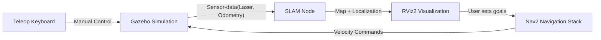

# Robot Simulation with SLAM and Navigation (Gazebo + RViz3)

This package provides a simulated mobile robot that performs **Simultaneous Localization and Mapping (SLAM)** in Gazebo and visualizes data in **RViz3**. After creating a map, you can switch to **navigation mode** using Nav2.

---

## Features
- Full robot simulation in Gazebo.
- Live visualization in RViz2.
- SLAM capability to generate maps of the environment.
- Nav2 navigation stack for autonomous movement once a map is built.
- Keyboard teleoperation support.

---
## Prerequisites

- ROS 2 Humble (or compatible distribution).
- Gazebo (Fortress or the version paired with your ROS 2 release).
- RViz2.
- Nav2 packages installed (nav2_bringup).
- teleop_twist_keyboard package for keyboard teleoperation.
---

## System Overview

The diagram below shows how the components interact:



---

## Getting Started
1. Clone the repository
```
git clone <your_repository_url> ~/your_ws/src
```
3. Build the workspace
```
cd ~/your_ws
colcon build
```
5. Source the workspace
```
source install/setup.bash
```

---

## Running the Simulation with SLAM
4. Launch the simulated robot with SLAM enabled
```
ros2 launch sambot_bringup simulated_robot.launch.py use_slam:=true world_name:=willowgarage
```
This will:
- Start Gazebo with the specified world (willowgarage in this example).
- Bring up the robot model with sensors configured for SLAM.
- Launch RViz3 with pre-configured topics.

5. Control the robot with the keyboard
In a new terminal
```
ros2 run teleop_twist_keyboard teleop_twist_keyboard
```
Use the displayed keys to drive the robot around and build the map.

---

## Running Navigation (after mapping)
6. Launch the navigation stack
```
Use the displayed keys to drive the robot around and build the map.
```
This will:
- Start the Nav2 stack with the saved map.
- Allow you to send navigation goals via RViz3.


